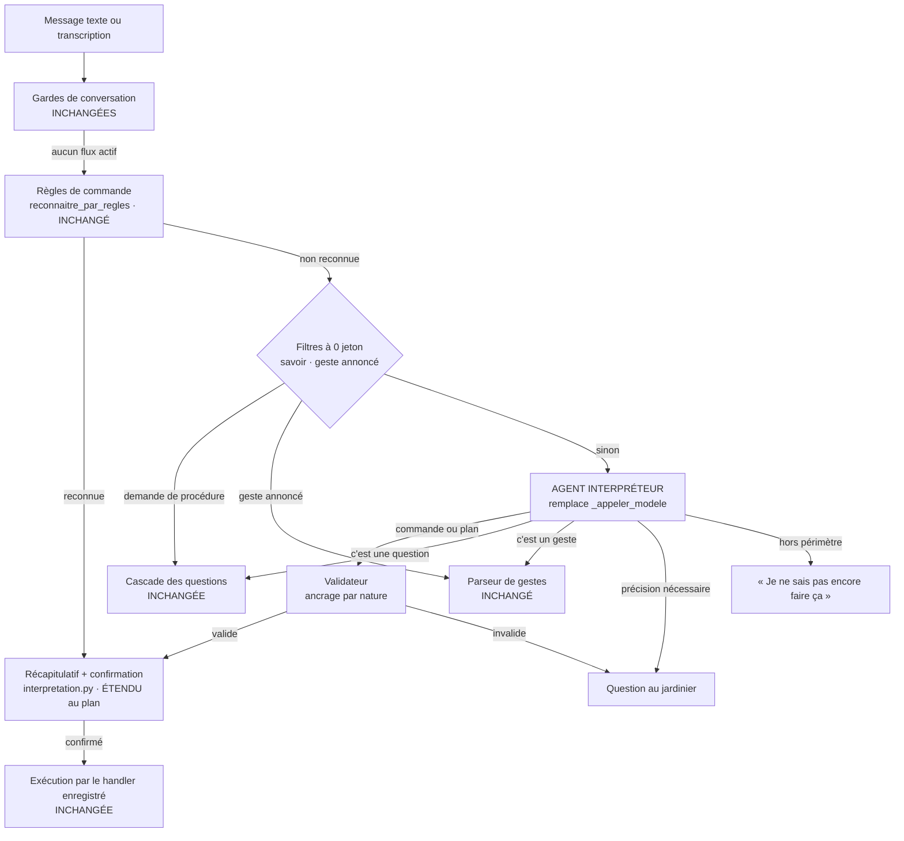

# Agent interpréteur : comprendre une demande et la traduire en commandes existantes

> **Statut** : proposition d'architecture du 10/10/2026. Aucune ligne de code
> écrite, aucune US créée dans Jira.
> **Périmètre** : le pilotage du potager par une phrase (bot Telegram, texte ou
> voix). Les gestes dictés et la cascade des questions ne changent pas.
> **Principe** : brancher un agent sur les points d'entrée qui existent déjà,
> sans refaire l'architecture.

---

## 0. L'essentiel en une page

**Le problème.** Le bot comprend une demande quand elle reprend une tournure que
quelqu'un a prévue à l'avance dans une expression régulière. « Ma serre extérieure
**est** une pépinière » marche. « Ma serre extérieure **n'est plus** une
pépinière » répond par la liste des lots. Chaque nouvelle tournure, chaque
négation, chaque demande en deux temps coûte une règle de plus, et
`interpreteur_commandes.py` fait déjà 2 640 lignes.

**La cause.** Le modèle de langage est déjà présent dans le circuit (repli de
l'interpréteur US-172), mais il est utilisé comme **classeur bridé** : il doit
répondre dans un format texte `COMMANDE|SOUS|args|CONFIANCE`, et toute valeur
qu'il produit doit **figurer mot pour mot** dans la phrase. `pepiniere=non` ne
figure pas dans « n'est plus une pépinière » : le garde-fou contre les
hallucinations interdit donc, par construction, de comprendre une négation.

**La proposition.** Confier au modèle ce qu'il sait faire (comprendre le sens)
et garder dans le code ce qu'il ne doit jamais faire seul (désigner une entité,
écrire en base) :

1. **Des outils typés** générés depuis le catalogue `FORMES_DICTABLES` existant :
   `est_pepiniere` devient un booléen, et le modèle gère la négation sans aucune
   règle.
2. **Un validateur** qui remplace l'ancrage mot pour mot par un **ancrage selon la
   nature de la valeur** : les noms de parcelle doivent exister en base, les
   nombres doivent avoir été dits, les valeurs d'une liste fermée peuvent être
   déduites.
3. **La même sortie qu'aujourd'hui** : l'agent produit des
   `CommandeInterpretee`, qui passent par le récapitulatif, la confirmation et
   l'exécution par introspection du handler (`app/bot/interpretation.py`).
   L'agent **propose**, il n'exécute jamais.

**Le point d'insertion.** Le remplacement de `_appeler_modele()` dans
`interpreteur_commandes.interpreter()`. Le contrat de sortie ne change pas, la
place dans le flux du bot non plus, et l'appel au modèle existe déjà à cet endroit.

**Le niveau d'autonomie visé.** Des plans de plusieurs commandes, confirmés en une
seule fois (niveau N2 du §2.4). Pas d'écriture sans confirmation.

---

## 1. Le constat, vérifié sur le code

### 1.1 Le chemin réel de la phrase

Vérification faite le 10/10/2026 en exécutant les étages déterministes sur la
phrase :

| Étape (`app/bot/messages.py`, `handle_text`) | Code | Résultat pour « Ma serre extérieure n'est plus une pépinière » |
|---|---|---|
| Gardes de conversation (priorités 1 à 2b) | modes `corr_*`, déplacement, note, `ask` | Rien d'actif, la phrase continue |
| Priorité 3e : règles de commande | `reconnaitre_par_regles()` | **`None`**. La règle `parcelle_pepiniere` exige `est\|devient… + article + pepiniere` ; « n'est **plus** une » ne correspond pas |
| Priorité 3e : repli modèle | `interpreter()` → `_appeler_modele()` | **Rejeté**. Même si le modèle répond `parcelle\|modifier\|serre extérieure;pepiniere=non\|0.9`, `_valider_sortie_modele()` refuse `pepiniere=non` : « argument absent de la phrase » |
| Priorité 4 : routeur | `routeur.classer_demande()` | **`QUESTION_DATA`**. Le mot « pépinière » fait partie de `_MARQUEURS_DATA` (`llm/routeur.py`, l. 302) |
| Cascade des questions | `_ask_question()` | Liste des lots en pépinière |

La phrase affirmative suit le même chemin et s'arrête à la priorité 3e, sur la
règle `parcelle_pepiniere` qui produit `modification='pepiniere=oui'`. À noter :
le routeur la classe **aussi** en `QUESTION_DATA`. Elle n'est sauvée que parce que
l'interpréteur passe avant lui.

### 1.2 Trois causes, une seule racine

1. **Les règles reconnaissent des formes, pas un sens.** Une négation, un
   synonyme (« ne sert plus de », « retire le statut de », « arrête la
   pépinière ») ou un autre ordre des mots demandent chacun un motif.
2. **Le repli modèle est muselé.** Son garde CA4 (« toute valeur qu'il produit
   doit se retrouver dans la phrase ») avait une intention juste : empêcher
   qu'une parcelle que personne n'a nommée soit proposée à la suppression. Mais
   il s'applique à **toutes** les valeurs, y compris celles qui se **déduisent**
   par nature (un booléen, une valeur d'une liste fermée). Par ailleurs,
   l'argument `modification` de `/parcelle modifier` est un texte libre
   `clé=valeur` : le modèle doit fabriquer une syntaxe au lieu de remplir un
   champ typé.
3. **Le routeur décide sur des mots-clés.** Un mot du domaine (« pépinière »,
   « rendement », « dans la parcelle ») vaut pour une consultation de données,
   alors que les mêmes mots apparaissent dans des déclarations.

**La racine commune.** Le système demande au modèle de **recopier** et au code de
**comprendre**. Il faut inverser les rôles.

### 1.3 Pourquoi ajouter des règles ne converge pas

Pour les seules caractéristiques d'une parcelle (`CHAMPS_FICHE` : superficie,
longueur, rangs, exposition, type de sol, abri, paillage, pépinière, actif), le
nombre de cas à couvrir se multiplie :

- 9 attributs ;
- × des tournures affirmatives, négatives (« n'est plus », « ne… pas », « retire »,
  « enlève »), de changement (« passe de… à… ») et d'annulation (« rangs=aucun ») ;
- × deux ordres des mots (nom en tête, verbe en tête), qui ont déjà conduit à
  deux règles pour la pépinière ;
- × la dictée vocale (sans ponctuation, avec des hésitations).

Le corpus `tests/corpus/us172_commandes.csv` le montre bien : 100 % de
reconnaissance sur **ce qu'on a su prévoir**. La docstring d'US-172 le reconnaît
elle-même : c'est la production qui dit quoi enrichir ensuite. Ce mécanisme
d'enrichissement continu est exactement ce que tu ressens comme « tout lui
apprendre par du code ».

---

## 2. Le raisonnement

### 2.1 Séparer trois tâches que le système actuel confond

| Tâche | Nature | Qui la fait aujourd'hui | Qui doit la faire |
|---|---|---|---|
| **Comprendre** l'intention : que veut le jardinier, sur quoi, dans quel sens ? | Linguistique, ouverte | Les regex (et un modèle bridé) | **Le modèle** |
| **Ancrer** les entités : quelle parcelle, quelle culture, quel lot ? | Factuelle, fermée | `_resoudre_noms_parcelle`, `resolve_parcelle` | **Le code, avec la base** (inchangé) |
| **Valider et exécuter** : droits, bornes, confirmation, écriture | Règles métier | Handlers et services | **Le code** (inchangé) |

Toute l'architecture découle de ce tableau. Le modèle n'a jamais accès en
écriture à la base ; le code n'a jamais à deviner une tournure de phrase.

### 2.2 « Le modèle propose, le code dispose »

L'agent produit des **intentions typées**, jamais des effets. Une intention
d'écriture ne devient une écriture qu'après :

1. une validation déterministe (§3.5) ;
2. un récapitulatif en clair, relu par le jardinier (déjà en place : CA10, CA11
   d'US-172) ;
3. l'exécution par le handler réellement enregistré (déjà en place : CA9).

L'agent ne remplace donc **aucune** protection existante. Il remplace seulement
la façon de produire la proposition.

### 2.3 Remplacer l'ancrage mot pour mot par un ancrage selon la nature de la valeur

C'est le changement de règle le plus important, et le seul qui touche à une
garantie existante. Il doit être tranché explicitement (révision de CA4
d'US-172).

| Nature de la valeur | Exemple | Règle actuelle | Règle proposée | Justification |
|---|---|---|---|---|
| **Entité nommée** (parcelle, culture, lot) | « serre extérieure » | Doit figurer dans la phrase | **Inchangée**, plus : doit exister en base, avec égalité exacte pour une commande destructrice (CA12) | C'est le risque réel : agir sur une parcelle que personne n'a nommée |
| **Nombre** | « 12 m », « 5 rangs » | Doit figurer dans la phrase | **Inchangée** (en chiffres ou en lettres) | Une quantité ne se déduit jamais |
| **Valeur fermée** (booléen, liste fermée) | `est_pepiniere=false`, `exposition=sud` | Doit figurer dans la phrase | **Peut être déduite**, mais doit appartenir au type du schéma | « n'est plus une pépinière » ⇒ `false` est le sens même de la phrase ; la liste fermée empêche toute invention |
| **Texte libre** (note, observation) | « feuilles jaunies » | Doit figurer dans la phrase | **Inchangée** | Pas de reformulation dans les données du jardinier |

Le récapitulatif reste le dernier rempart : « Je vais **retirer** le statut
pépinière de *Serre extérieure*. Confirmer ? » Une déduction fausse s'y voit
avant d'être écrite.

### 2.4 Quel degré d'autonomie ?

| Niveau | Ce que fait le système | État |
|---|---|---|
| **N0** | Règles seules, une commande | Majorité des cas aujourd'hui |
| **N1** | Le modèle comprend et propose **une** commande ; confirmation | Phases 1 et 2 |
| **N2** | Le modèle construit un **plan** de plusieurs commandes, avec des lectures intermédiaires (trouver une parcelle, lister les lots) ; **une** confirmation pour tout le plan | **Cible** (phase 4) |
| **N3** | Le modèle exécute lui-même les écritures sans confirmation | **Écarté** |

Pourquoi s'arrêter à N2 : les données du jardinier (son historique, ses lots, son
stock) n'ont pas de bouton « annuler » général. Une confirmation par plan coûte
une pression de bouton ; une erreur silencieuse en N3 coûte la confiance dans
l'outil. Des exceptions ciblées restent possibles plus tard (commandes de pure
consultation : elles ne sont déjà pas confirmées aujourd'hui).

### 2.5 Pourquoi des outils typés plutôt qu'un meilleur prompt

Améliorer le prompt texte actuel (`COMMANDE|SOUS|args|CONFIANCE`) se heurterait
à trois limites :

- **Le format est ad hoc.** Il faut le découper et le réparer, et un point-virgule
  dans un nom suffit à le casser. L'appel d'outils (*function calling*,
  compatible OpenAI, pris en charge par le SDK `groq` du projet) renvoie du JSON
  structuré par le fournisseur.
- **Le typage porte le sens.** Déclarer `est_pepiniere: boolean` apprend au modèle
  qu'une négation donne `false`, sans un mot d'explication. C'est la réponse
  directe à « je dois tout lui apprendre par du code » : on décrit **ce que
  l'application sait faire**, pas **comment le jardinier parle**.
- **Le chaînage devient possible.** Un modèle qui appelle des outils peut en
  appeler plusieurs, et lire un résultat avant de décider de la suite (N2).

### 2.6 Pourquoi garder les règles, et où

Les règles ne disparaissent pas. Elles changent de statut : elles deviennent une
**optimisation**, plus le seul moyen de comprendre.

| On garde en règles | Parce que |
|---|---|
| Les gestes dictés (« récolté 2 kg de tomates », `parseur_deterministe`) | 97 % captés à zéro jeton, en volume dominant, avec une latence nulle |
| Les commandes `/xxx` tapées | Déterministes par nature |
| Les gardes de conversation (modes `corr_*`, `ask`, complétion) | Elles portent un état de dialogue, pas une interprétation |
| Les règles de commande déjà écrites | Elles marchent et ne coûtent rien ; on les **gèle** : plus de nouvelles règles pour couvrir une tournure, on ajoute la phrase au corpus d'évaluation de l'agent |
| Le garde `_est_demande_de_savoir` | « Comment supprimer une parcelle ? » ne doit jamais coûter un appel d'agent |

Ce qui change de statut : les **marqueurs de données par mot-clé** du routeur.
Ils restent valables **après** l'agent, pour les messages qu'il n'a pas pris en
charge, mais un mot du domaine ne doit plus suffire à court-circuiter une
déclaration (phase 3).

---

## 3. La structure cible

### 3.1 Vue d'ensemble



Ce qui est **nouveau** tient en trois boîtes : l'agent, le validateur et
l'extension de la proposition à un plan. Tout le reste existe déjà.

### 3.2 Les composants

| Fichier | Statut | Rôle |
|---|---|---|
| `llm/passerelle.py` | **Modifié** | Nouvelle fonction `appeler_chat_outils()` qui accepte `outils` et `tool_choice` et renvoie le texte plus les `tool_calls`. Nouveau type d'appel `TYPE_AGENT` (modèle réglable par `GROQ_MODEL_AGENT`). Même journalisation, même consommation, même repli 429. La passerelle reste le seul point de sortie vers le modèle |
| `app/services/agent/catalogue_outils.py` | **Nouveau** | Génère les schémas JSON des outils depuis `menu_commandes.FORMES_DICTABLES`, `parcelles.CHAMPS_FICHE` et `vocabulaires_fiche()`. Aucune liste tenue à la main. Test de parité : toute forme dictable a son outil |
| `app/services/agent/adaptateurs.py` | **Nouveau** | Traduit un appel d'outil typé en `CommandeInterpretee` existante. Exemple : `{est_pepiniere: false}` → `valeurs={'nom': …, 'modification': 'pepiniere=non'}` |
| `app/services/agent/validation.py` | **Nouveau** | Règles d'ancrage du §2.3, vocabulaires, droits, une seule commande destructrice par plan |
| `app/services/agent/outils_lecture.py` | **Nouveau (phase 4)** | Outils de lecture exécutés pendant la boucle : `trouver_parcelle`, `lister_parcelles`, `trouver_lot`, `trouver_culture`. Ils appellent les services existants et renvoient un JSON compact |
| `app/services/agent/interpreteur_agent.py` | **Nouveau** | L'appel (phase 1) puis la boucle bornée (phase 4). Renvoie `CommandeInterpretee \| Ambiguite \| Plan \| Aiguillage \| None` |
| `app/services/interpreteur_commandes.py` | **Modifié (peu)** | `interpreter()` appelle l'agent à la place de `_appeler_modele()` quand `AGENT_MODE=actif`. Les règles ne bougent pas |
| `app/bot/interpretation.py` | **Modifié (phase 4)** | `_traiter_commande_interpretee` accepte un `Plan` : récapitulatif en étapes numérotées, une confirmation, exécution séquentielle qui s'arrête au premier échec |
| `app/bot/messages.py` | **Modifié (phase 3)** | Réagit à un `Aiguillage` (question, geste) renvoyé par l'agent sans repasser par `classer_demande` |
| `app/config.py`, `.env.example` | **Modifié** | `AGENT_MODE=off\|ombre\|actif`, `GROQ_MODEL_AGENT`, `AGENT_MAX_TOURS` |

Pourquoi sous `app/services/` et pas sous `llm/` : l'agent connaît le métier
(commandes, parcelles, droits), alors que `llm/` est la couche d'accès au modèle.
Et pourquoi pas sous `app/bot/` : la PWA pourra réutiliser l'agent (barre de
commande) sans dépendre de Telegram.

### 3.3 Le catalogue d'outils

**Générer, ne jamais écrire à la main.** Le catalogue `FORMES_DICTABLES` porte
déjà tout ce qu'il faut : arguments, types, vocabulaires fermés, unités, drapeaux
`destructrice` et `confirmation`, question à poser si un argument manque. Il
suffit de le projeter en JSON Schema. Ajouter une commande au bot ajoute donc un
outil, et le test de parité d'US-172 (`controler_parite()`) protège déjà cette
cohérence.

**Une seule évolution du catalogue : typer les arguments composites.**
`/parcelle modifier` reçoit aujourd'hui un texte `clé=valeur`. L'outil, lui,
expose des champs typés dérivés de `CHAMPS_FICHE`, et l'adaptateur les
resérialise pour le handler, qui reste inchangé :

```json
{
  "type": "function",
  "function": {
    "name": "parcelle_modifier",
    "description": "Modifie les caractéristiques d'une parcelle existante. Ne renseigner que ce que le jardinier change.",
    "parameters": {
      "type": "object",
      "properties": {
        "parcelle":       {"type": "string", "description": "Nom de la parcelle tel que dit par le jardinier"},
        "est_pepiniere":  {"type": "boolean", "description": "true si la parcelle devient une pépinière, false si elle cesse de l'être"},
        "type_pepiniere": {"type": "string", "enum": ["chaude", "froide"]},
        "longueur_m":     {"type": "number"},
        "nb_rangs":       {"type": "integer"},
        "exposition":     {"type": "string"},
        "abri":           {"type": "string", "enum": ["…vocabulaires_fiche()…"]},
        "actif":          {"type": "boolean"}
      },
      "required": ["parcelle"]
    }
  }
}
```

**Regrouper pour limiter la taille.** Les 38 formes dictables donneraient 38
outils. On vise une quinzaine d'outils, un par commande avec sa sous-commande en
`enum` quand les arguments se ressemblent (`lot_consulter`, `parcelle_lister`…),
et des outils dédiés quand le typage diffère (`parcelle_modifier`). Moins d'outils
veut dire un préfixe plus court et des choix plus nets pour le modèle.

**Des outils d'aiguillage, sans effet.** L'agent doit pouvoir dire que la demande
n'est **pas** une commande, au lieu d'en forcer une :

| Outil terminal | Effet |
|---|---|
| `poser_question(nature)` | Rend la main à la cascade des questions existante (`DATA`, `SAVOIR`, `HYBRIDE`) |
| `saisir_geste()` | Rend la main au parseur de gestes |
| `demander_precision(question)` | Pose une question au jardinier, rien n'est exécuté |
| `hors_perimetre(raison)` | « Je ne sais pas encore faire ça », phrase journalisée pour alimenter le catalogue |

L'appel se fait avec `tool_choice="required"` : l'agent choisit **toujours** un
outil, il ne répond jamais en texte libre à cet étage.

### 3.4 L'appel, puis la boucle

**Phases 1 à 3 : un appel unique.** Le message système contient le catalogue (la
partie fixe, mise en cache côté fournisseur) puis une courte partie variable :
la date et **la liste des noms de parcelles et de pépinières du potager**. Cette
liste, de quelques dizaines de noms, permet au modèle de rattacher « la serre »
à « Serre extérieure » sans outil de lecture. Le validateur tranche ensuite
l'égalité exacte (CA12).

**Phase 4 : une boucle bornée.**

```text
messages = [système(catalogue, contexte), utilisateur(phrase)]
plan = []
pour tour de 1 à AGENT_MAX_TOURS (3) :
    réponse = passerelle.appeler_chat_outils(messages, outils, tool_choice="required")
    pour chaque appel de réponse.tool_calls :
        si appel est un outil de LECTURE   → exécuter, renvoyer le résultat au modèle
        si appel est un outil d'ÉCRITURE   → ajouter au plan (NON exécuté), répondre « noté »
        si appel est un outil TERMINAL     → renvoyer l'aiguillage, fin
    si aucun appel de lecture à ce tour → fin
valider(plan) → Plan | Ambiguite | demande de précision
```

Les écritures ne sont **jamais** exécutées dans la boucle. Une étape qui dépend
d'une écriture précédente (« crée la planche nord et plantes-y 6 tomates »)
désigne l'entité **par son nom**, comme une commande tapée. Elle ne dépend donc
pas d'un identifiant qui n'existe pas encore.

### 3.5 Le validateur

Il s'exécute sur chaque intention d'écriture, avant tout affichage. Il est
déterministe et entièrement testable sans modèle.

1. **Schéma** : outil connu, types respectés, valeurs dans la liste fermée. Sinon,
   rejet.
2. **Entités** : chaque nom de parcelle passe par la résolution actuelle
   (`_resoudre_noms_parcelle`). Égalité exacte : la valeur est acceptée. Nom
   voisin : il est **proposé**, jamais substitué (CA12). Nom inconnu : demande de
   précision.
3. **Nombres** : chaque nombre doit apparaître dans la phrase, en chiffres ou en
   lettres (CA11). Sinon, rejet.
4. **Commandes destructrices** : au plus une par plan, entité en égalité exacte,
   jamais issue d'une déduction.
5. **Droits** : contrôlés à l'exécution par le handler, comme aujourd'hui. Le
   validateur peut les anticiper pour éviter de proposer ce qui sera refusé.
6. **Potager** : toujours celui de `TenantContext`, jamais un argument produit
   par le modèle.

### 3.6 Le contrat de sortie

```python
@dataclass(frozen=True)
class Plan:
    """[US-AGENT-4] Plusieurs commandes comprises d'une phrase, confirmées en une fois."""
    etapes: tuple[CommandeInterpretee, ...]
    texte_origine: str
    latence_ms: int = 0

@dataclass(frozen=True)
class Aiguillage:
    """[US-AGENT-3] La phrase n'est pas une commande : l'agent dit où elle va."""
    vers: str                     # "question" | "geste" | "precision" | "hors_perimetre"
    nature_question: str | None   # QUESTION_DATA | QUESTION_SAVOIR | QUESTION_HYBRIDE
    message: str | None           # précision demandée ou raison du hors périmètre
```

`CommandeInterpretee` et `Ambiguite` sont réutilisées telles quelles, avec
`origine = "agent"`. En phase 1, l'agent ne renvoie que ces deux types : le bot ne
voit **aucune** différence.

### 3.7 Journalisation et coût

- **Journal** : `routage_logs` porte déjà `nature=COMMANDE`, l'étage et l'issue
  (`proposee`, `confirmee`, `refusee`, `abandonnee`). On ajoute
  `origine=agent` et les noms des outils appelés. Le taux de propositions
  **refusées** par le jardinier devient l'indicateur de qualité en production.
- **Coût** : l'agent **remplace** un appel qui existe déjà. Aujourd'hui, toute
  phrase qui n'est ni une règle, ni une demande de procédure, ni un geste annoncé
  paie déjà un appel de classification au repli de l'interpréteur. Le préfixe
  grossit (de l'ordre de 2 à 3 000 jetons pour le catalogue en outils, **à
  mesurer**), mais il est fixe, donc cacheable. La passerelle mesure déjà
  `tokens_cache`.
- **Repli** : si le modèle est indisponible (429, panne) ou si le modèle de la
  clé du potager (BYOK) ne gère pas les outils, retour au comportement actuel
  (règles puis routeur), sans message intermédiaire au jardinier.

---

## 4. Quatre phrases déroulées

### 4.1 La négation (le cas de départ)

> « Ma serre extérieure n'est plus une pépinière »

1. Règles : `None`. Filtres : pas une demande de procédure, pas un geste.
2. Agent : `parcelle_modifier(parcelle="serre extérieure", est_pepiniere=false)`.
3. Validation : « serre extérieure » existe exactement ✔︎ ; `false` est du bon type
   et déduit, ce qui est autorisé ✔︎ ; aucun nombre.
4. Adaptateur : `/parcelle modifier serre extérieure pepiniere=non`.
5. Récapitulatif : « Je retire le statut **pépinière** de *Serre extérieure*.
   (Commande équivalente : `/parcelle modifier serre extérieure pepiniere=non`)
   [Confirmer] [Annuler] ».

À noter : la commande équivalente reste affichée. C'est la moitié pédagogique de
CA10, qui reste intacte.

### 4.2 Une question qui contient le même mot

> « Quelles sont mes pépinières ? »

`/parcelle lister` ne sait pas filtrer les pépinières : l'agent choisit donc
`poser_question(nature="QUESTION_DATA")`, ce qui rend la main à la cascade
actuelle, qui sait déjà y répondre. Le mot « pépinière » ne décide plus rien : c'est la structure de la
phrase qui décide.

### 4.3 Une demande en plusieurs temps (phase 4)

> « Crée la planche nord, 8 mètres de long avec 4 rangs, et mets la serre en pépinière froide »

Plan proposé :

```text
1. Créer la parcelle « planche nord »          (/parcelle ajouter planche nord)
2. Régler sa longueur à 8 m et ses rangs à 4   (/parcelle modifier planche nord longueur=8 rangs=4)
3. Faire de « Serre » une pépinière froide     (/parcelle modifier serre pepiniere=froide)
[Tout confirmer] [Annuler]
```

Le validateur vérifie que « 8 » et « 4 » figurent dans la phrase, et que
« planche nord » n'existe **pas** encore (sinon : « elle existe déjà, je passe à
l'étape 2 ? »).

### 4.4 Hors du catalogue

> « Exporte-moi tout l'historique en Excel »

L'agent répond `hors_perimetre("aucun export disponible")`. Le jardinier lit
« Je ne sais pas encore exporter vers Excel », au lieu d'une liste d'événements
obtenue par un mot-clé. La phrase est journalisée : c'est une demande de
fonctionnalité, pas une règle à écrire.

---

## 5. Ce qui change, ce qui ne change pas, ce qu'on abandonne

**Ne change pas**

- les gardes de conversation et leur ordre de priorité ;
- le parseur déterministe des gestes et l'analyse unifiée qui le suit ;
- la cascade des questions (catalogue SQL, socle de connaissance, raisonnement) ;
- les services, les handlers, les droits et le garde de liaison ;
- le récapitulatif, la confirmation et l'exécution par introspection
  (`interpretation.py`, CA9 et CA10) ;
- la règle « tout appel au modèle passe par `llm.passerelle` », la BYOK et le
  mode dégradé 429 ;
- les règles de commande existantes, conservées et gelées.

**Change**

- `_appeler_modele()` est remplacé par l'agent, avec le même contrat de sortie ;
- la règle d'ancrage CA4 d'US-172 passe à l'**ancrage selon la nature de la
  valeur** (§2.3). C'est une **révision explicite de CA**, à écrire comme
  telle ;
- `interpretation.py` accepte un plan (phase 4) ;
- les mots-clés de données du routeur ne suffisent plus à capter une phrase que
  l'agent a déjà prise en charge (phase 3).

**Abandonné**

- le format texte `COMMANDE|SOUS|args|CONFIANCE` et son analyse ;
- la position de la docstring d'US-172 : « aucune planification, aucune boucle
  d'outils, aucun enchaînement autonome ». Elle était juste à l'époque, pour
  livrer un périmètre sûr ; elle est levée ici, dans un cadre (N2, écritures
  jamais exécutées dans la boucle) ;
- l'écriture de nouvelles règles de commande pour couvrir une tournure. Une
  tournure ratée devient une ligne du corpus d'évaluation.

---

## 6. Livraison en US

Chaque phase est livrable seule, réversible par `AGENT_MODE`, et apporte une
valeur visible dès la phase 2.

| Phase | US (à créer) | Contenu | Critère de sortie |
|---|---|---|---|
| **S0** | Spike | Vérifier sur 30 phrases du corpus que le modèle Groq retenu gère correctement les outils en français (négations, choix entre outils voisins), et mesurer la latence et les jetons | Go/no-go du modèle, chiffres réels du §3.7 |
| **1** | Passerelle | `appeler_chat_outils()`, `TYPE_AGENT`, journalisation, repli. Aucun changement de comportement | Tests passerelle verts, audit des appels LLM à jour |
| **2** | Agent, une commande | Catalogue généré, adaptateurs, validateur, remplacement de `_appeler_modele()`, révision de CA4. `AGENT_MODE=ombre` puis `actif` | Le cas « n'est plus une pépinière » passe. Corpus US-172 ≥ 100 % des formes reconnues aujourd'hui, **0 exécution destructrice erronée** |
| **3** | Aiguillage | Outils terminaux, `Aiguillage` traité par `messages.py`. Les mots-clés de données du routeur ne passent plus avant une déclaration | « Quelles sont mes pépinières ? » et « la serre n'est plus une pépinière » vont chacune au bon endroit |
| **4** | Plans | Outils de lecture, boucle bornée, `Plan`, récapitulatif en étapes, exécution séquentielle | Phrases multi-étapes du corpus proposées correctement, une seule confirmation |
| **5** | Contexte court | Les 2 ou 3 derniers échanges et la proposition en attente sont passés à l'agent : « non, l'autre », « et la planche sud aussi » | Corpus de suites de conversation |

**Définition de terminé, à chaque phase qui change un comportement** : mettre à
jour la fiche du corpus `data/connaissance/doc_app/` qui décrit le pilotage par
une phrase (règle US-099 / CA9 de `CLAUDE.md`), et la fiche
`docs/domaines/commandes-bot.md`.

---

## 7. Évaluation

Les tests unitaires seuls ne suffisent pas : ils doivent simuler le modèle. Il
faut deux niveaux.

| Niveau | Quoi | Quand |
|---|---|---|
| **Tests unitaires** (pytest, SQLite) | Passerelle simulée qui renvoie des `tool_calls` prédéfinis. On teste le **validateur**, les **adaptateurs**, la génération du catalogue, la parité, le traitement d'un `Plan` | À chaque commit |
| **Évaluation réelle** (`tools/evaluer_agent.py`) | Le vrai modèle sur le corpus, rapport de taux par catégorie | Manuellement, avant chaque passage en `actif`, et après tout changement de modèle |

Le corpus d'évaluation part de `tests/corpus/us172_commandes.csv` (162 commandes,
36 questions de savoir voisines, 27 phrases hors périmètre). On l'enrichit de :

- **négations et retraits** pour chaque attribut booléen et chaque liste fermée ;
- **paires piégeuses** : la même phrase en déclaration et en question
  (« la serre est une pépinière » / « la serre est-elle une pépinière ? ») ;
- **demandes en plusieurs étapes** (phase 4) ;
- **phrases de production** remontées par `routage_logs` avec l'issue `refusee`
  ou `abandonnee`.

Couperets, identiques à ceux d'US-172 : **0 exécution destructrice erronée**, et
aucune régression sur ce que les règles reconnaissent aujourd'hui (elles passent
avant l'agent, donc c'est garanti par construction, mais on le vérifie).

---

## 8. Risques et parades

| Risque | Parade |
|---|---|
| Le modèle déduit une mauvaise valeur fermée (`true` au lieu de `false`) | Récapitulatif en langage clair (« je **retire** »), confirmation obligatoire, taux de refus suivi |
| Il invente une parcelle | Liste des noms réels dans le contexte, résolution exacte par le validateur, proposition jamais substituée (CA12) |
| Latence perçue à la voix | Groq est rapide ; on n'appelle l'agent qu'après les règles ; mesure en S0 |
| Quota Groq (offre gratuite) | L'agent remplace un appel existant ; cache du préfixe ; repli sur le comportement actuel en cas de 429 |
| Modèle d'une clé BYOK sans prise en charge des outils | Test de capacité au premier appel, mémorisé ; repli sur l'ancien chemin |
| Injection de consignes via des données lues (notes du jardinier renvoyées par un outil de lecture) | Les résultats d'outils sont marqués comme données ; aucune écriture sans confirmation humaine ; outils de lecture limités au potager courant |
| Dérive du catalogue (une commande ajoutée sans outil) | Génération automatique, plus le test de parité existant |
| Coût de maintenance du prompt | Pas de liste de tournures dans le prompt : seulement le catalogue généré et une dizaine de consignes stables |

---

## 9. Arbitrages à faire

| # | Question | Recommandation |
|---|---|---|
| A1 | Accepter la révision de CA4 d'US-172 (valeurs fermées déductibles) ? | **Oui** : c'est la condition pour comprendre une négation |
| A2 | Niveau d'autonomie cible | **N2** (plans confirmés en une fois) ; N3 écarté |
| A3 | Geler l'écriture de nouvelles règles de commande dès la phase 2 ? | **Oui**, sauf pour les commandes destructrices fréquentes, où une règle garantit le déterminisme |
| A4 | Modèle de l'agent | Décidé par le spike S0 ; `GROQ_MODEL_AGENT` séparé de `GROQ_MODEL_CLASSIFICATION` pour pouvoir changer l'un sans l'autre |
| A5 | L'agent sert-il aussi la PWA (barre de commande) ? | Pas avant la phase 4 ; l'architecture le permet (agent dans `app/services/`) |
| A6 | Faut-il passer le geste dicté par l'agent quand le parseur déterministe échoue ? | **Non** dans ce chantier : l'analyse unifiée des gestes (`TYPE_PARSING`) couvre déjà ce cas |
